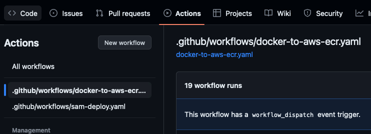
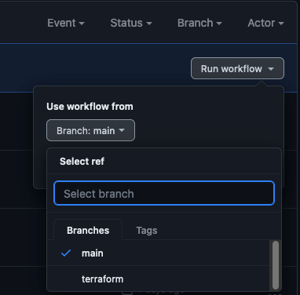

# Eksamen PGR301 2023 - Kandidat-2026

Table of Contents:
- [Oppgave 1](#oppgave-1-kjells-pythonkode)
- [Oppgave 2](#oppgave-2-overgang-til-java-og-spring-boot)
- [Oppgave 3](#oppgave-3-terraform-aws-apprunner-og-iac)
- [Oppgave 4 - Feedback](#oppgave-4-feedback)
- [Oppgave 4 - Drøfteoppgaver](#oppgave-4-drøfteoppgaver)
- [Github Actions Workflow](#github-actions-workflow)

## Oppgave 1. Kjells Pythonkode
```
Eftersom att uppgiften inte specifiserar att vi ska skriva om variabler och metoder
i python-programmet som kjell har skapat, så har jag valt att inte göra det.
Jag poängterar istället ut att map-strukturen kjell/hello_world inte är opptimal
för lambda-funktionen.
```
### A. SAM and GitHub actions workflow
- [X] Fjerne hardkoding av S3 bucket navnet app.py koden, slik at den leser verdien "BUCKET_NAME" fra en miljøvariabel.
  - app.py läser bucket name fra **BUCKET_NAME = os.environ['BUCKET_NAME']**
- [X] For hver push til main branch, skal arbeidsflyten bygge og deploye Lambda-funksjonen.
  - .github/workflows/sam-deploy.yaml bygger och deployar från ./kjell.
- [X] Som respons på en push til en annen branch en main, skal applikasjonen kun bygges.
  -  Deploy jobbet körs bara om condition **if: github.ref == 'refs/heads/main'** möts.
- [X] Forklar hva sensor må gjøre for å få GitHub Actions workflow til å kjøre i sin egen GitHub-konto.
  -  Gå till [Github Actions Workflow](#github-actions-workflow) för att se svar på den här oppgaven.
- [X] Sensor kan köra det här kommandot för att testa så att Dockerfilen fungerar.

```shell
docker build -t kjellpy . 
docker run -e AWS_ACCESS_KEY_ID=XXX -e AWS_SECRET_ACCESS_KEY=YYY -e BUCKET_NAME=kjellsimagebucket kjellpy
```

## Oppgave 2. Overgang til Java og Spring Boot

### A. Dockerfile
- [X] Lag en Dockerfile for Java-appliksjonen. Du skal lage en multi stage Dockerfile som både kompilerer og kjører applikasjonen.
  - Dockerfilens build och prod stages brukar olika images.
- [X] Sensor kan köra det här kommandot för att testa så att Dockerfilen fungerar.

```shell
docker build -t kjellpy . 
docker run -e AWS_ACCESS_KEY_ID=XXX -e AWS_SECRET_ACCESS_KEY=YYY -e BUCKET_NAME=kjellsimagebucket kjellpy
```

### B. GitHub Actions workflow for container image og ECR
- [X] Lag en GitHub actions workflow som ved hver push til main branch lager og publiserer et nytt Container image til et ECR repository.
  - .github/workflows/docker-to-aws-ecr.yaml publiserar till ECR **kandidat-2026** vid push till main.
- [X] Workflow skal kompilere og bygge et nytt container image, men ikke publisere image til ECR dersom branch er noe annet en main.
  - Build and push Docker image kör bara om condition **if: github.ref == 'refs/heads/main'** möts.
- [X] Du må selv lage et ECR repository i AWS miljøet, du trenger ikke automatisere prosessen med å lage dette.
  - Laget ECR repository: **244530008913.dkr.ecr.eu-west-1.amazonaws.com/kandidat-2026**
- [X] Container image skal ha en tag som er lik commit-hash i Git, for eksempel: glenn-ppe:b2572585e.
- [X] Den siste versjonen av container image som blir pushet til ECR, skal i tillegg få en tag "latest".
  - **docker tag ppe 244530008913.dkr.ecr.eu-west-1.amazonaws.com/kandidat-2026:latest**
  - **docker push 244530008913.dkr.ecr.eu-west-1.amazonaws.com/kandidat-2026:latest**

## Oppgave 3. Terraform, AWS Apprunner og IAC

### A. Kodeendringer og forbedringer
- [X] Fjern hardkodingen av service_name, slik at du kan bruke ditt kandidatnummer eller noe annet som
  service navn.
  - Lagat variable **candidate**
- [X] Se etter andre hard-kodede verdier og se om du kan forbedre kodekvaliteten.
  - Brukt **${var.candidate}**
- [X] Reduser CPU til 256, og Memory til 1024.

### B. Terraform i GitHub Actions
```
Utifrån uppgave-texten så antar jag att det inte ska sättas någon branch protection på main.
Då det står att delar av workflowsen enbart ska köras på "push till main" så har jag
låtit det vara så att man KAN pusha direkt till main. 
```
- [X] Utvid din GitHub Actions workflow som lager et Docker image, til også å kjøre terraformkoden.
  - Laget nytt jobb **"Terraform"**
- [X] På hver push til main, skal Terraformkoden kjøres etter jobber som bygger Docker container image.
  - Condition: **needs: build_docker_image**
- [X] Du må lege til Terraform provider og backend-konfigurasjon. Dette har Kjell glemt. Du kan bruke
  samme S3 bucket som vi har brukt til det formålet i øvingene.
- [X] Beskriv også hvilke endringer, om noen, sensor må gjøre i sin fork, GitHub Actions workflow eller
  kode for å få denne til å kjøre i sin fork.
  -  Gå till [Github Actions Workflow](#github-actions-workflow) för att se svar på den här oppgaven.

## Oppgave 4. Feedback

### A. Utvid applikasjonen og legg inn "Måleinstrumenter"
- [X] Nå som dere har en litt større kodebase. Gjør nødvendige endringer i Java-applikasjonen til å bruke
  Micrometer rammeverket for Metrics, og konfigurer for leveranse av Metrics til CloudWatch.
- [X] Dere skal skrive en kort begrunnelse for hvorfor dere har valgt måleinstrumentene dere har gjort, og
  valgene må være relevante.
```
Jag har baserat mitt svar på att det tas bilder från en kamera
där man gärna vill veta under vilken tid som helst hur många personer
som har på sig PPE eller inte, och kunna agera utifrån informationen man samlar
in med dessa metrics.

Jag har antagit att det här är en kamera som sitter ovanför en dörr in till ett kontor/labb.
Och var 5e minut så vill den sända en grupp bilder till bucketen, som sen rapporterar hur 
många violations som försigår, och där efter kan ansvarig agera.

Användningen av olika metoder för olika sorters PPE kan komma till hands
då man kan ha olika krav på PPE i olika lokaler/labber.
Har man flera kameror så kan de använda sig av respektive http metoder för
att hämta information om PPE baserat på just dom kraven den lokalen/labbet har.
```
  - Percentage of violations based on images scanned 
    ```
    Typ: Gauge
    
    Det här måleinstrumentet implementerade jag eftersom jag vill kunna se en prosentuell
    visning på hur många violations som förekommer baserat på hur många bilder som tagits.
    
    Är det en hög procent och många bilder tagna, så är det något som är väldigt fel och behöver
    åtgärdas direkt.
    ```
  - Individual number of deviations for each body part
    ```
    Typ: Bar
    
    I samband med det första måleinstrumentet, så vill jag ha en mer precis information
    om hur många personer som inte har på sig PPE. 
    
    Det här måleinstrumentet vill visa
    exakt hur många personer som har scannats på alla bilder, tillsammans med
    hur många olika sorters PPE som manglar på dom personer som scannats.
    
    Den här informationen är nyttig eftersom den scannar alla personer i bilderna,
    oberoende av violations.
    ```
  - Average latency of requests per scanning methods
    ```
    Type: Meter
    
    Det här måleinstrumentet ska mäta den genomsnittliga tiden det tar
    för varje metod att processera en http request.
    
    Om man ser att det tar väldigt lång tid för requests att köras så kan
    det vara värt att se på applikationen och försöka finna ut vad problemet är.
    
    Det här kan vara bra för att finna ut om man kan behöva en limit med bilder i bucketen,
    ifall requestsen tar för lång tid då den fyllts upp.
    ```

### B. CloudWatch Alarm og Terraform moduler

- [X] Lag en CloudWatch-alarm som sender et varsel på Epost dersom den utløses, skriv en kort redgjørelse for valget.
```
Jag har valt att sätta en limit på antallet violations på hjälmar i bucketen till max 8.
Det vill säga att om sensor lägger in bilder som gör att minst 3 till personer scannas,
och dom 3 personerna inte har hjälm på sig, så utlöses alarmet.

Det står i besvarelsen att vi ska laga 1 alarm, så jag har förhållit mig till det.
Jag kunde ha lagat flera alarmer för till exempel latency och en gräns på accepterad procent
violations/images. 
Det är några alarmer som hade gett mening också, men jag valde att
laga ett som är lätt att testa att det fungerar.
```

## Oppgave 4. Drøfteoppgaver

### A. Kontinuerlig Integrering
  - [X] Forklar hva kontinuerlig integrasjon (CI) er og diskuter dens betydning i utviklingsprosessen.
    ```
    Kontinuerlig integration (CI) är en metod för programvaruutveckling där alla utvecklarnas 
    arbetskopior slås samman till en gemensam huvudgren flera gånger under utvecklings-processen. 
    Detta gör det möjligt att upptäcka och åtgärda fel tidigt, vilket förbättrar kodkvaliteten och 
    effektiviserar utvecklingsprocessen.
    
    På Github kan man arbeta med CI genom att använda Github Actions, som är en 
    integrerad tjänst för kontinuerlig integration och kontinuerling leverans (CI/CD).
    Github Actions låter utvecklare definera, köra och dela arbetsflöden för att automatisera 
    programvaruutveckling och testning.
    Till exempel, kan man definera ett arbetsflöde som bygger och testar koden varje gång 
    det görs en ändring i huvud-grenen(main), och bestämmer att arbetsflödena måste lyckas köra för
    att den nya koden ska accepteras.
    
    Inom ett utvecklingsteam med fyra till fem utvecklare är det möjligt att organisera 
    arbetsflödena i Github Actions på ett sätt som passar teamets behov. 
    Om teamet utvecklar en applikation med mikrotjänster kan arbetsflöden skapas för specifika ändamål. 
    Till exempel kan ett arbetsflöde fokusera på att bygga en mikrotjänst
    och utföra tester, medan ett annat arbetsflöde hanterar händelser i huvudgrenen. 
    Om en utvecklare gör en ändring som kräver tyngre arbete, som att distribuera 
    hela applikationen på Azure eller AWS, kan detta arbetsflöde triggas.
    
    Detta tillvägagångssätt gör att utvecklaren inte behöver vänta på hela processen 
    varje gång en ändring görs på utvecklar-grenen. 
    Istället kan arbetsflödena anpassas för att vara snabbare och mer riktade, vilket ökar 
    produktiviteten och gör utvecklingsprocessen smidigare.
    ```
  
### B. Sammenligning av Scrum/Smidig og DevOps fra et Utviklers Perspektiv

#### 1. Scrum/Smidig Metodikk:
  - [X] Beskriv kort, hovedtrekkene i Scrum metodikk og dens tilnærming til programvareutvikling.
    ```
    När man använder sig av Scrum så jobbar man oftast med Sprints.
    Sprintarnas längd kan variera mellan 1 vecka eller upp till 1 månad. 
    Scrum-teamet, som består av uppåt 10 personer, utvärderar framstegen 
    teamet har gjort på dagliga möten som varar 
    15 minuter eller mindre, kallade dagliga scrums, eller stand up möten.
    
    Vid slutet av sprinten har teamet ytterligare två möten, sprintöversyn 
    där man visar det arbete man gjort för att få feedback, och sprintutvärdering 
    där teamet kan reflektera kring sina misstag, och göra förbättringar.
    
    Scrum-metodiken utmanar traditionella produktutvecklingsmetoder som vattenfallsmodellen 
    genom att använda en flexibel och iterativ approach.
    Den främjar nära samarbete och daglig kommunikation mellan alla teammedlemmar.
    Teamet organiserar sig självt och har täta samarbeten.
    Produktägaren prioriterar arbetsuppgifter, och Scrum Master stöder teamet.
    Daglig kommunikation sker genom stå-upp-möten, vilket främjar öppenhet och 
    snabb problemlösning.
    Genom självorganisering och nära samarbete möjliggör Scrum en smidigare och effektivare produktutveckling.
    ```
  - [X] Diskuter eventuelle utfordringer og styrker ved å bruke Scrum/Smidig i
    programvareutviklingsprosjekter.
    ```
    Fördelarna med att arbeta smidigt i projekt är att man kan jobba flexibelt 
    och dra nytta av varje utvecklares unika kompetens.
    Om någon är specialist inom ett område kan de ta på sig specifika uppgifter 
    och sedan hjälpa till på andra områden vid behov.
    Det nära samarbetet med produktägaren möjliggör ökad flexibilitet när det 
    gäller förändringar i krav och design.
    Individer får ta ansvar för olika delar av projektet, vilket leder 
    till bättre samordning och motivation inom gruppen.

    Utmaningarna med att använda Scrum/Smidig i programvaruutvecklingsprojekt är dock tydliga.
    Det kan vara svårt att förutsäga händelser i projektet, och det är utmanande 
    att fastställa exakt hur lång tid olika delar av en sprint kommer att ta.
    Detta gör det svårt att förutse och planera för ändringar i kraven från produktägaren. 
    En ökad grad av osäkerhet kan uppstå, vilket kräver flexibilitet och 
    förmåga att anpassa sig till förändringar under projektets gång.
    ```

#### 2. DevOps Metodik:
  - [X] Forklar grunnleggende prinsipper og praksiser i DevOps, spesielt med tanke på integrasjonen av
    utvikling og drift.
    ```
    DevOps är en metodik som strävar efter att integrera utveckling och drift för att 
    effektivisera och kontinuerligt leverera högkvalitativ programvara till kunder.
    Genom att tillämpa DevOps skapas sammanhängande team där utvecklare och driftspersonal 
    arbetar nära varandra istället för i isolerade roller.

    Till exempel i händelse av en plötslig belastningsökning, möjliggör DevOps-principer 
    automatisering av infrastrukturskalning, realtidsövervakning av systemprestanda och snabb 
    implementering av förbättringar.
    Detta sker genom ett nära samarbete mellan utvecklare och driftspersonal, vilket gör 
    att organisationen snabbt kan anpassa sig till förändrade krav och leverera högkvalitativa tjänster till sina användare.
     ```
  - [X] Analyser hvordan DevOps kan påvirke kvaliteten og leveransetempoet i programvareutvikling.
    ```
    Automatisering används för att accelerera repetitiva uppgifter, vilket minimerar 
    fel och ökar hastigheten i leveransprocessen.
    En betoning på övervakning och mätning möjliggör snabbare identifisering och åtgärdande av problem.
    Effekterna av DevOps på programvaruutveckling inkluderar ökad hastighet, förbättrad 
    kvalitet och stabilitet i programvaran samt ökat förtroende och återhämtningsförmåga vid fel.
  - [X] Reflekter over styrker og utfordringer knyttet til bruk av DevOps i utviklingsprosjekter.
    ```
    Styrkor med DevOps inkluderar förbättrat samarbete, ökad produktivitet och högre kundnöjdhet.
    Utmaningar omfattar behovet av att förändra organisationskulturen, arbetsprocesserna och 
    implementera nya teknologier och verktyg.
    Framgångsrik implementering av DevOps kräver tekniska och organisatoriska förändringar 
    för att skapa en smidig och effektiv utvecklings- och driftsmiljö.

    Ett exempel på en utmaning med att använda DevOps i ett utvecklingsprojekt kan vara integrationsutmaningar 
    i befintliga organisationsstrukturer och svårigheter med att förändra organisationens kultur.
    ```
#### 3. Sammenligning og Kontrast:
  - [X] Sammenlign Scrum/Smidig og DevOps i forhold til deres påvirkning på programvarekvalitet og
    leveransetempo.
    ```
    Scrum/Smidig främjar nära samarbete och iterativ utveckling för att förbättra kvaliteten och leveranstempot
    genom regelbunden feedback och snabba anpassningar.
    Iterativ utveckling, som nämnt tidigare, gör det möjligt att upptäcka och åtgärda problem tidigt.
    Snabba iterationscykler möjliggör snabbare leverans av funktionalitet till användare.
    Kontinuerliga produktleveranser ger kunden mervärde med kortare intervaller.

    DevOps strävar efter att automatisera och förena utvecklings- och driftsprocesser för att öka hastigheten och förbättra kvaliteten.
    Automatisering inom DevOps, särskilt av testning och distribution, minskar risken för fel och 
    möjliggör snabbare identifiering och åtgärdande av problem.
    DevOps strävar efter att öka hastigheten på utvecklingsprocessen och minimera tiden det tar att få 
    produkter till marknaden. Kontinuerlig leverans och automatisering möjliggör snabba och regelbundna produktleveranser.
    
    Sammanfattningsvis, medan Scrum/Smidig är mer inriktat på projektledning och iterativ utveckling,
    är DevOps bredare och strävar efter att förändra hela mjukvaru-leveransprocessen genom automatisering 
    och integration av utveckling och drift.
    Många organisationer implementerar dock båda för att dra nytta av fördelarna från båda metodikerna.
    ```
  - [X] Diskuter hvilke aspekter ved hver metodikk som kan være mer fordelaktige i bestemte
    utviklingssituasjoner.
    ```
    Scrum/Agile är fördelaktigt när nära samarbete och kontinuerlig värdeleverans krävs.
    Dessa metoder anpassar sig väl till föränderliga krav och möjliggör tidig och frekvent testning med aktiv kundinvolvering.
    
    DevOps är idealiskt för att påskynda utvecklingsprocesser och minska tid till 
    marknaden genom automatisering av tester och distribution.
    Det betonar även att minimera driftstopp och fel genom kontinuerlig förbättring och kollaboration mellan utvecklings- och driftsteam.
    
    Det kan vara fint att kombinera Scrum/Agile och DevOps för en 
    balanserad strategi som hanterar både iterativ utveckling och kontinuerlig leverans 
    genom hela mjukvaru-leveransprocessen.
    ```

### C. Det Andre Prinsippet - Feedback
  - [X] Tenk deg at du har implementert en ny funksjonalitet i en applikasjon du jobber med. Beskriv hvordan du vil
    etablere og bruke teknikker vi har lært fra "feedback" for å sikre at den nye funksjonaliteten møter
    brukernes behov.
    ```
    Jag ville använda ett arbetsflöde som bygger och testar applikationen för att enkelt kunna verifiera 
    att den fungerar som den ska (CI).
    Dessutom ville jag skapa en mall för hur applikationen ska byggas framöver för att säkerställa att 
    eventuella uppdateringar genomförs inom de ramar som har fastställts från början (IaC).

    Slutligen önskade jag att skapa ett dashboard och ett larm för den nya funktionen för att kunna 
    övervaka dess funktionalitet medan kunden testar den.
    Om något inte fungerar som det ska, kan det snabbt åtgärdas inom en kontrollerad miljö, eftersom 
    jag har sett till att funktionen kan uppdateras på ett smidigt sätt.
    ```
## Github Actions Workflow
```
Sensor kan välja att göra någon liten ändring i koden och pusha till main, eller en annan branch.
Det går också att köra workflows genom workflow dispatch, då kan sensor välja själv vilken branch
som workflowsen ska köras mot.
Gå sedan in på respektive branch och se att workflowen har kört.
```

